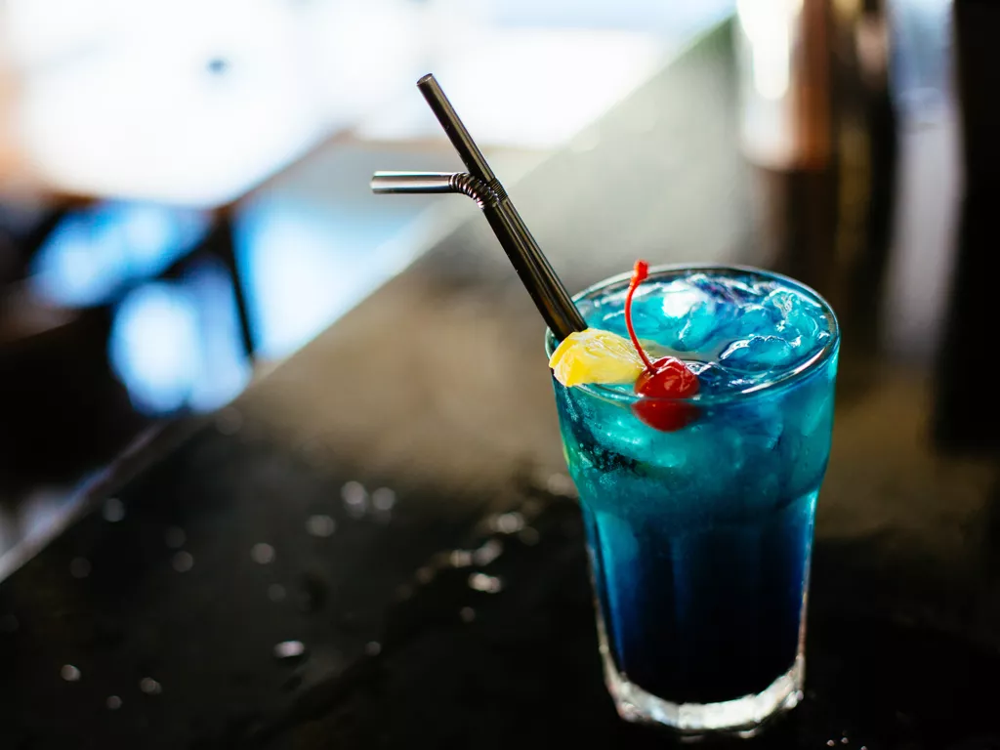

*Disclaimer: Contains Alcohol*

Having a bad day? Need a pick-me-up?
With this quick and easy cocktail, you'll be feeling like the owner in no time! The drink's vividly blue color is bound to catch *anybody's* eye at the bar or at home.

## Ingredients:
* 22.5mL Vodka (0.75 oz)
* 22.5mL Gin (0.75 oz)
* 22.5mL White Rum (0.75 oz)
* 22.5mL Blanco Tequila (0.75 oz)
* 22.5mL Blue Curacao (0.75 oz)
* 22.5mL Sour Mix (0.75 oz)
* Dash of Lemon Lime Soda
* A target vulnerable to blue drinks
* Optionals:
* Cherry garnish
* Mint garnish
* Ice~~cast~~

## Instructions:
1. Combine all non-soda ingredients into a shaker
2. Shake vigorously (ice optional)
3. Pray that it ended up mixing properly
4. Win
5. Pour into iced glass with soda and serve immediately

And now you can enjoy your perfectly guilt-free drink at your own leisure!*

*I am not responsible for any loss of memory or damage to property as caused by the execution of the drink or any post-excursions caused by the drink's effects. Please enjoy Eternal Blue responsibly.*
