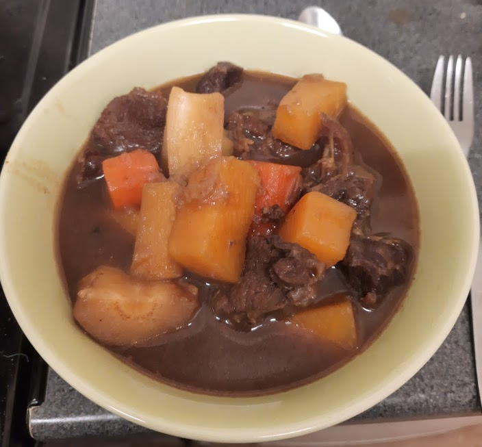

*Disclaimer: Contains some alcohol which doesn't really boil off*
Feeds 3+ hungry students, or keeps in the fridge for up to 3 days for several meals.

This stew is ideal for the winter, or any time of the year. It's reasonably cheap, if you can find well priced stew beef. It tastes great, and is very filling.

## Ingredients:
* 3 Medium Potatoes
* 3 Carrots
* 1 Small swede (rutabaga) or half of a larger swede
* 1 large onion, or 2 smaller onions. Onion is good. Use plenty.
* 2 Parsnips
* 400g (1lb) Diced Stewing Beef. I like using Beef Shin, but regular lean diced beef works too.
* 1 bottle (500ml) Dark English beer, Hobgoblin or Guiness work well. I use Lidl's Purple Panther Porter because it's cheap.
* 1 beef stock cube (bouillon cube in the US), reasonable quality. Alternatively, around 500ml beef stock. Low sodium means you have more control over the salt
* Dark soy sauce
* Paprika (Smoked paprika works nicely)
* Salt and black pepper to taste. Ideally freshly ground!
* Your chosen thickening agents, I suggest a flour and oil/butter roux or corn flour/starch slurry. This can be supplemented with gravy granules

## Instructions:
1. Slice onion, into thin slices. Ensure all chunks of beef are roughly the same size. 
2. Dice potatoes, swede, carrot, and parsnip into roughly 5cm long chunks. It's fairly important that these are the same size.
3. Heat a little oil over a low heat in a tall deep pot, approximately 3L capacity. A casserole dish or dutch oven here would also be ideal. Add beef and onions. Add salt, pepper, and paprika to taste. Cook gently and thoroughly brown the beef and ideally get some colour on the onions. Low heat here is ideal to get thorough browning all over the beef. If it looks like too much fat has rendered, pour it aside to add to the stock later.
4. While the beef and onions brown, prepare the liquid that you'll use to deglaze. In a roughly 500ml jug/pitcher, prepare the beef stock (aka add hot water if you're using cubes). Add any fat set aside earlier, this is a big source of beef flavour.
5. Once the beef and onions are browned, quickly pour in the beef stock and be sure to scrape the bottom of the pot with a wooden spoon to get all that lovely brown stuff. Add the beer, along with some soy sauce for richness, and stir.
6. Stirring every half hour or so, let the beef stew for around an hour. If you have more tender beef, you might only need half an hour. If you have very tough beef, it might need longer. You might need your intuition here. You can always grab a bit from the bot and see how cooked it is.
7. Add the potatoes, carrots, swede, and parsnip to the pot. Don't stir quite yet, the veg will somewhat steam with the lid on. If there's not enough liquid to cover almost all of the veg, add some hot water. 
8. Cook for 15 minutes, stir to make sure nothing is sticking to the bottom and to mix the beef in with the veg. If the stew is too thin for you, add thickening agent(s)
9. Cook for a further half hour covered. Optionally serve with bread, ideally crusty but regular bread works too.

To reheat, microwave **covered** until fully hot throughout, time tends to vary batch to batch for some reason. Remember, stews are often much better the next day.
If you want to change it up a little, try frying diced mushrooms with the beef and onions, and/or adding garlic, or toasting the bread!
This recipe is dairy free, and gluten free if you use a gluten free thickener and skip the beer (Or if you can find a gluten free dark beer?)